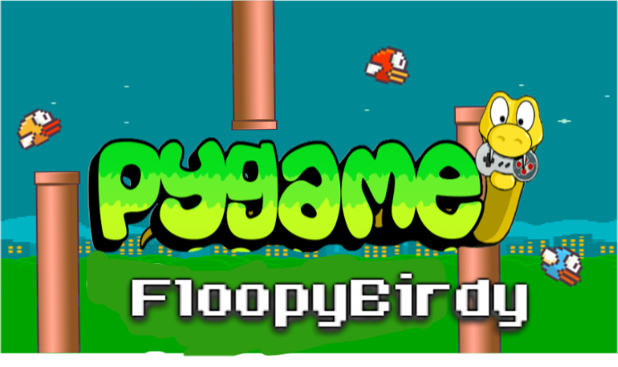
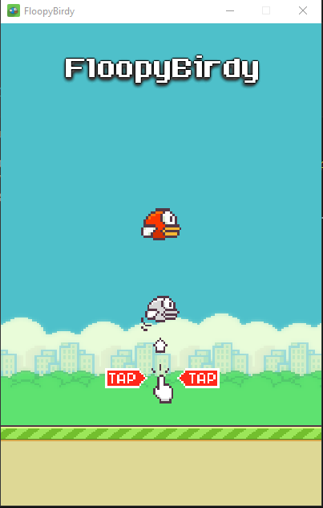
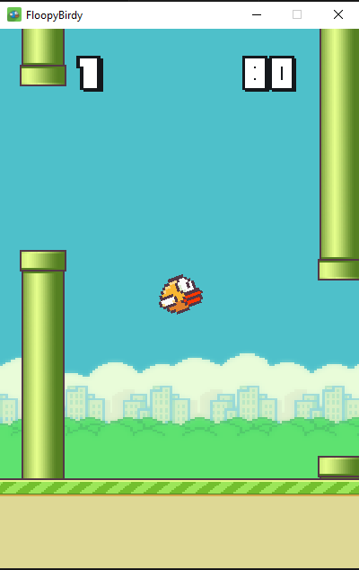
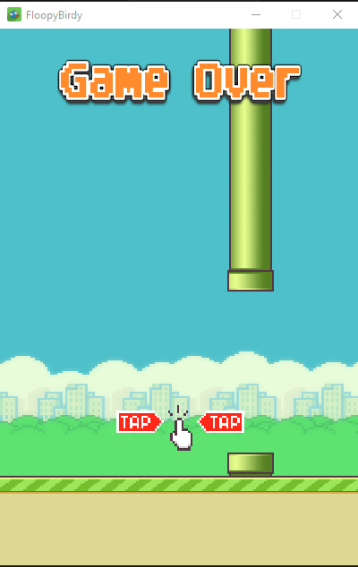

# FloopyBirdy

A simple clone of the classic Flappy Bird game implemented in Python using the Pygame library.

## Table of Contents

- [Description](#description)
- [Screenshots](#screenshots)
- [Dependencies](#dependencies) 
- [Installation](#installation)
- [Usage](#usage)
- [Contributing](#contributing)
- [License](#license)

## Description

This project is a recreation of the popular Flappy Bird game, developed using Python and the Pygame library. It features addictive gameplay, kinda smooth graphics, and fun endless runner.

## Screenshots

### After the game is launched

### During gameplay

### Game over

## Dependencies

- `python3` is required.
- `pygame` will be installed automatically if not already installed. This may not work on linux distros where the python environments are externally managed such as arch linux. in those, you have to manually install pygame package.

## Installation

- Clone this repo using the command `git clone https://github.com/srykrnm/FloopyBirdy` on you terminal or cmd.
- go to the directory `FloopyBirdy/src` and just run `main.py` file. 
- thats it.
- Enjoy.

## usage 

- After running the `main.py` script; the game will be lauched with an interface asking you to click to start the game.
- You can use `left mouse button` for controls.
- Start the game by hitting the mouse control, then use the mouse control to navigate the bird through pillars.
- For every pillar the bird passes through successfully the score will be incremented by 1.
- As the score increases the rate at which the bird moves increases making it harder.
- This is a endless runner , so the objective is to score the highest.
- During gameplay the current score will be displayed on the top left while the highest on the top right.
- Highest score will be stored in a text file.
- Hitting the pillars, the ground or the roof will cause you to lose the game and the game will return to starting interface prompting you to click to start again

## Contributing

Contributions are welcome! Please fork the repository and submit a pull request with your changes. For major changes, please open an issue first to discuss what you would like to change.

## License

This project is licensed under the GNU General Public License v3.0. See the [LICENSE](LICENSE) file for details.
